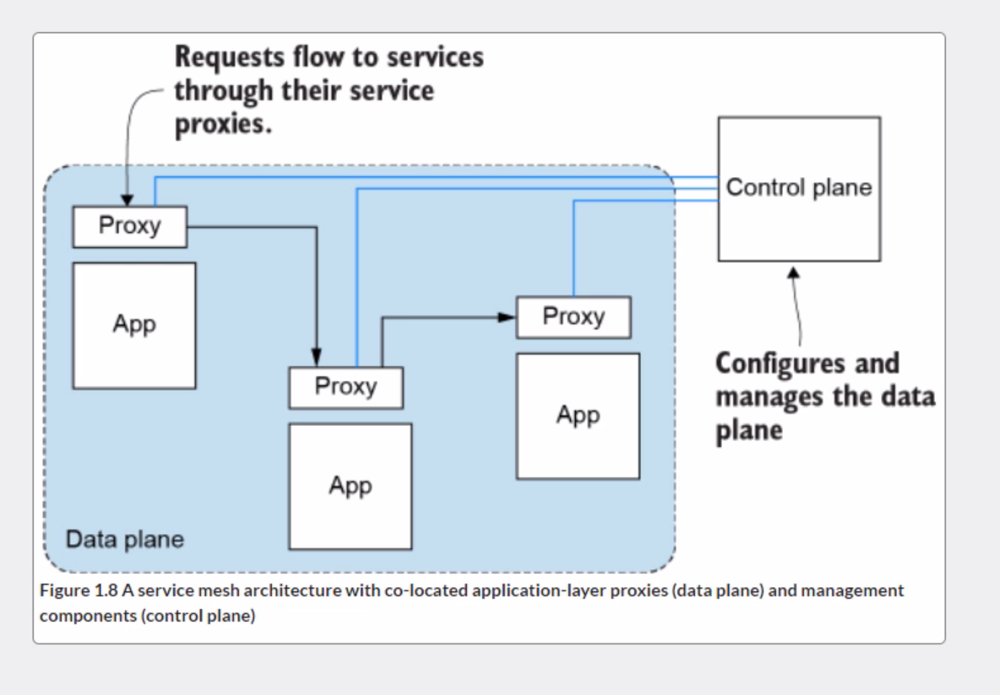
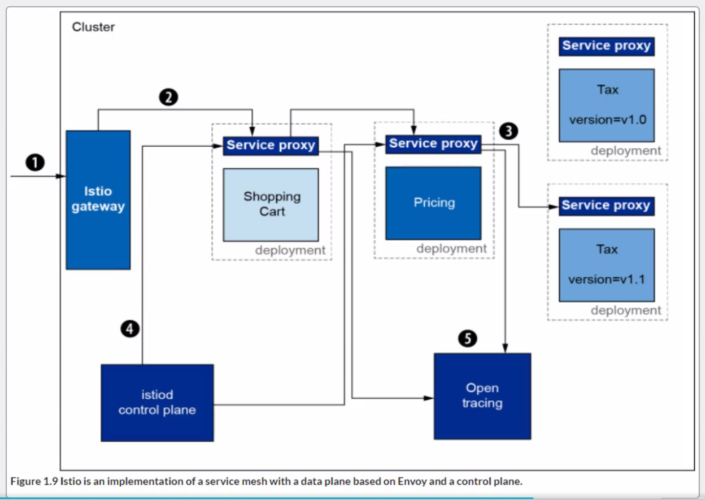
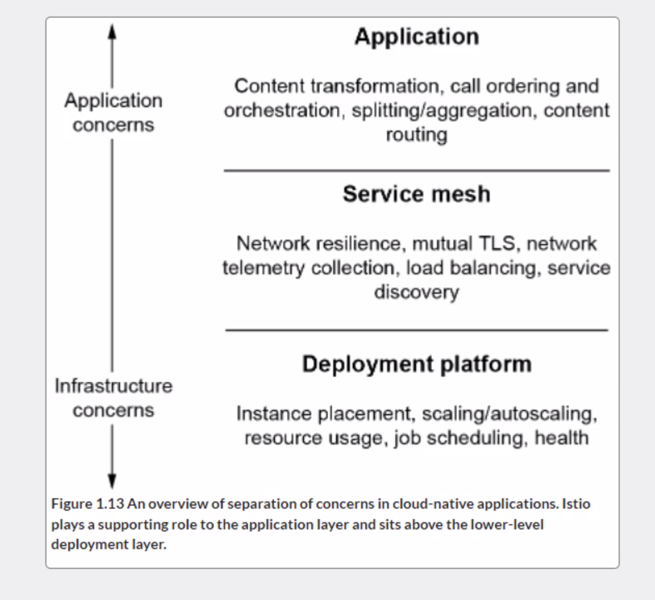

### Chapter I

- The Customer service is overloaded and runing slowly.
- The customer service has a bug.
- The network has firewalls that are slowing the traffic.
- The network is congested and is slowing traffic.
- The network experienced some failed harware and is rerouting traffic.
- The network card on the Customer service hardware is experiencing failures.

#### Some Patterns

- Client-side load balancing
- Service discovery
- Circuit breaking
- Bulkheding
- Timeouts
- Retries
- Retry budgets.
- Deadlines 

A proxy is an intermediate infraestrcuture component that can handle connections and redirect them to appropiate backends.

#### Envoy proxy

Service mesh, work together to provide functionality, a side car deployment.

#### Service Mesh

- Service resilience
- Observability signals
- Traffic control capabilities
- Security
- Policy enforcement

> With a service proxy next to each application instance, applications
> no longer need language-specific resilisience libraries for circuit
> breaking, timeouts, retries, service discovery, load balancing and so on.
> 

---

>Istio plays the role of connective tissue between the deployment platform and the application
code. Its role is to facilitate taking complicated networking code
out of the application.
It can do content-based routing based on external metadata that is part 
of the request.It can do fine-grained traffic control
and routing based onservice and request metadata matching.

#### Drawbacks to using a service mesh.

Puts another piece of middleware, specifically a proxy.

#### To summarize

The data plane, which is composed of servie proxies that are deployed
alongside applications and complement them by implementing policies,
managing traffic, generating metrics and traces.

The control plane which exposes an API for operators to manipulate
the data plane's network behavior.
