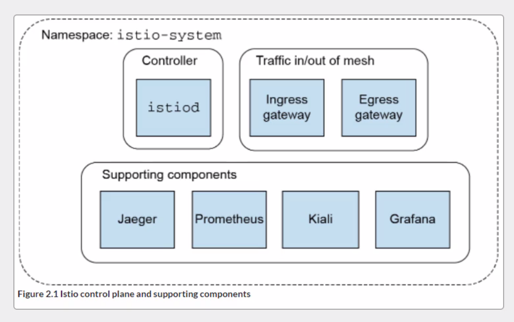
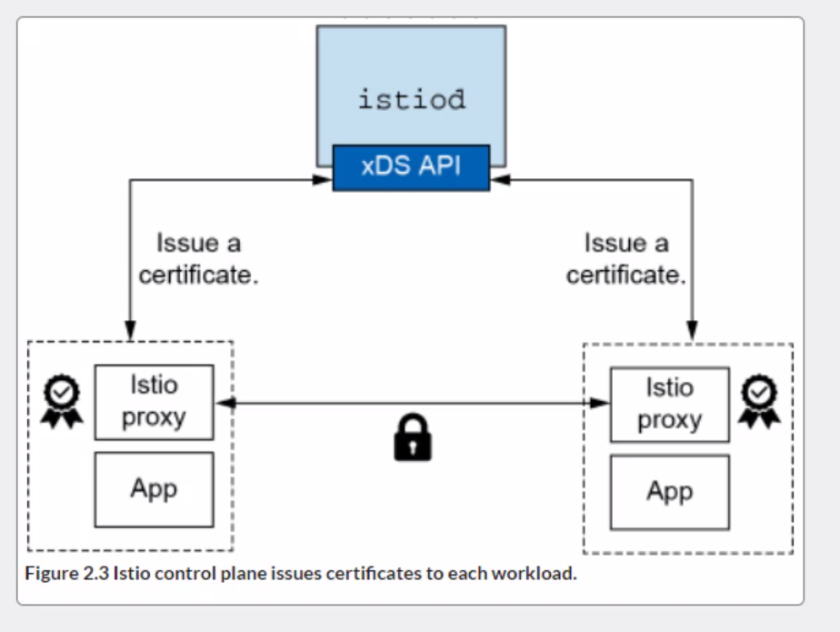

### First steps with Istio.

##### Installation

>  curl -L https://istio.io/downloadIstio | ISTIO_VERSION=1.13.0 sh -

cd istio-1.13.0

bin/istioctl version

##### Control Plane

- APIs for operators to specify desired routing/resilience behavior.
- APIs for the data plane to consume their configuration.
- A service discovery abstraction for the data plane.
- APIs for specifyng usage policies
- Certificate issuance and rotation
- Workload identity assignment
- Unified telemetry collection and reporting
- Service-proxy sidecar injection
- Specification of network boundaries and how to access them.

